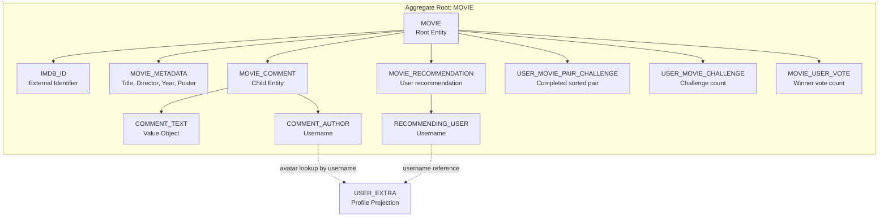
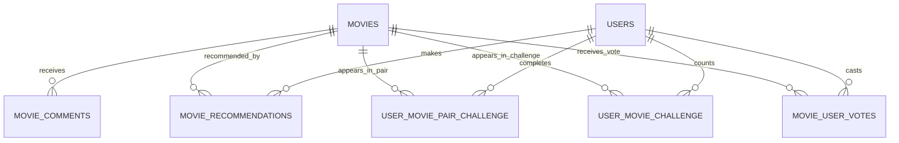

# Movie Catalog Capability Entity Model

The `movie-catalog` Software Capability owns movie discovery, movie contribution, movie discussion, movie
recommendations, movie challenges, and admin movie maintenance. The `MOVIE` aggregate is the consistency boundary.
`MOVIE_COMMENT` is a child entity because comments cannot exist without a movie and are deleted with it.
`MOVIE_RECOMMENDATION` records the current user's endorsement of a movie. Movie challenge records are per-user
projections over recommended movies: completed pairs prevent duplicate challenges, challenge counts prioritize
under-participating movies, and votes count selected winners.

## Aggregate Boundary Diagram

## Entity Relationship Diagram

### MOVIE

| Attribute | Description | Data Type | Validation Rules |
|-----------|-------------|-----------|------------------|
| imdb_id | IMDb identifier used as catalog identity | String | Primary Key, Not Blank |
| title | Movie title shown in catalog cards | String | Not Null, Not Blank on create |
| director | Director name or `N/A` | String | Not Null, Not Blank on create |
| release_year | Release year or `N/A` | String | Not Null, Not Blank on create |
| poster | Poster URL from OMDb or fallback image | String | Optional, max 2048 characters |

### MOVIE_COMMENT

| Attribute | Description | Data Type | Validation Rules |
|-----------|-------------|-----------|------------------|
| id | Comment identifier | Long | Primary Key, Identity |
| movie_imdb_id | Owning movie | String | Foreign Key, Cascade Delete |
| username | Comment author | String | Not Null, taken from authenticated principal |
| text | User comment | String | Not Blank, max 4000 characters |
| timestamp | Creation time | Instant | Not Null |

### MOVIE_RECOMMENDATION

| Attribute | Description | Data Type | Validation Rules |
|-----------|-------------|-----------|------------------|
| user_id | Recommending username | String | Foreign Key to users.username, Primary Key part |
| movie_id | Recommended IMDb id | String | Foreign Key to movies.imdb_id, Primary Key part |

### USER_MOVIE_PAIR_CHALLENGE

| Attribute | Description | Data Type | Validation Rules |
|-----------|-------------|-----------|------------------|
| user_id | Challenged username | String | Foreign Key to users.username, Primary Key part |
| movie1_id | Alphabetically first IMDb id in the completed pair | String | Foreign Key to movies.imdb_id, Primary Key part, less than movie2_id |
| movie2_id | Alphabetically second IMDb id in the completed pair | String | Foreign Key to movies.imdb_id, Primary Key part |

### USER_MOVIE_CHALLENGE

| Attribute | Description | Data Type | Validation Rules |
|-----------|-------------|-----------|------------------|
| user_id | Challenged username | String | Foreign Key to users.username, Primary Key part |
| movie_id | Movie that appeared in a challenge | String | Foreign Key to movies.imdb_id, Primary Key part |
| challenge_count | Number of challenge appearances for this user and movie | Integer | Not Null, non-negative |

### MOVIE_USER_VOTE

| Attribute | Description | Data Type | Validation Rules |
|-----------|-------------|-----------|------------------|
| user_id | Voting username | String | Foreign Key to users.username, Primary Key part |
| movie_id | Selected movie winner | String | Foreign Key to movies.imdb_id, Primary Key part |
| vote_count | Number of times this user selected this movie | Integer | Not Null, non-negative |

### MOVIE_CATALOG

Read model used by `view-movie-catalog`.

| Attribute | Description | Data Type | Validation Rules |
|-----------|-------------|-----------|------------------|
| movies | Movies sorted by title | List<MOVIE> | May be empty |
| recommended | Whether each movie is recommended by the current user | Boolean | False for anonymous viewers |

### MOVIE_DETAILS

Read model used by `view-movie-details`.

| Attribute | Description | Data Type | Validation Rules |
|-----------|-------------|-----------|------------------|
| movie | Selected movie | MOVIE | Must exist |
| comments | Comments with avatar data | List<MOVIE_COMMENT> | Newest first |
| recommended | Whether the selected movie is recommended by the current user | Boolean | False for anonymous viewers |

### MOVIE_CHALLENGE

Read model used by `movie-challenge`.

| Attribute | Description | Data Type | Validation Rules |
|-----------|-------------|-----------|------------------|
| movie1 | First recommended movie in the challenge pair | MOVIE metadata | Selected from recommended movies only |
| movie2 | Second recommended movie in the challenge pair | MOVIE metadata | Different from movie1 |
| completed_pair | Alphabetically sorted pair identity | USER_MOVIE_PAIR_CHALLENGE | Must not already exist for the user |

### FAVORITE_MOVIES

Read model used by `view-favorite-movies`.

| Attribute | Description | Data Type | Validation Rules |
|-----------|-------------|-----------|------------------|
| movies | Movies with at least one vote by the current user | List<MOVIE> | Sorted by `movie_user_votes.vote_count` descending |
| recommended | Whether each favorite movie is still recommended by the current user | Boolean | Enriched from MOVIE_RECOMMENDATION |

## Aggregate Insight

`add-movie-to-catalog`, `add-movie-comment`, `recommend-movie`, `movie-challenge`, and `administer-movie-catalog` mutate
the movie-catalog model. Catalog, detail, and favorite views are read use cases over the same aggregate and include
recommendation state when the viewer is authenticated. Comment avatar enrichment crosses into `user-access` only as a
read lookup by username.
