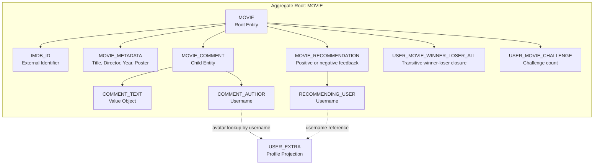
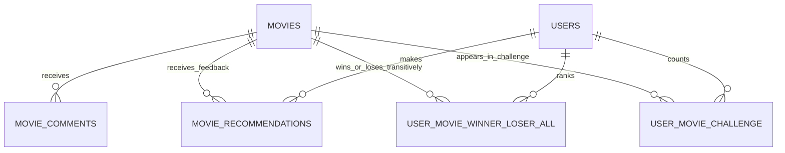

# Movie Catalog Capability Entity Model

The `movie-catalog` Software Capability owns movie discovery, movie contribution, movie discussion, movie
recommendations, movie challenges, and admin movie maintenance. The `MOVIE` aggregate is the consistency boundary.
`MOVIE_COMMENT` is a child entity because comments cannot exist without a movie and are deleted with it.
`MOVIE_RECOMMENDATION` records the current user's positive or negative feedback for a movie. Movie challenge records are
per-user projections over positively recommended movies: transitive winner-loser closure prevents duplicate or
already-inferred challenges, while challenge counts prioritize under-participating movies. Users recommended movies are
a weighted read model over matching transitive winner-loser relationships and other users' transitive win counts.

## Aggregate Boundary Diagram

## Entity Relationship Diagram

### MOVIE

| Attribute | Description | Data Type | Validation Rules |
|-----------|-------------|-----------|------------------|
| imdb_id | IMDb identifier used as catalog identity | String | Primary Key, Not Blank |
| title | Movie title shown in catalog cards | String | Not Null, Not Blank on create |
| director | Director name or `N/A` | String | Not Null, Not Blank on create |
| release_year | Release year or `N/A` | String | Not Null, Not Blank on create |
| poster | Poster URL from OMDb or fallback image | String | Optional, max 2048 characters |

### MOVIE_COMMENT

| Attribute | Description | Data Type | Validation Rules |
|-----------|-------------|-----------|------------------|
| id | Comment identifier | Long | Primary Key, Identity |
| movie_imdb_id | Owning movie | String | Foreign Key, Cascade Delete |
| username | Comment author | String | Not Null, taken from authenticated principal |
| text | User comment | String | Not Blank, max 4000 characters |
| timestamp | Creation time | Instant | Not Null |

### MOVIE_RECOMMENDATION

| Attribute | Description | Data Type | Validation Rules |
|-----------|-------------|-----------|------------------|
| user_id | Feedback author username | String | Foreign Key to users.username, Primary Key part |
| movie_id | Feedback IMDb id | String | Foreign Key to movies.imdb_id, Primary Key part |
| positive | Whether the feedback is a positive recommendation | Boolean | Not Null, default `true`; `false` means disliked |

### USER_MOVIE_WINNER_LOSER_ALL

| Attribute | Description | Data Type | Validation Rules |
|-----------|-------------|-----------|------------------|
| user_id | Challenged username | String | Foreign Key to users.username, Primary Key part |
| winner_id | Direct or inferred winning movie | String | Foreign Key to movies.imdb_id, Primary Key part |
| loser_id | Direct or inferred losing movie | String | Foreign Key to movies.imdb_id, Primary Key part, different from winner_id |

### USER_MOVIE_CHALLENGE

| Attribute | Description | Data Type | Validation Rules |
|-----------|-------------|-----------|------------------|
| user_id | Challenged username | String | Foreign Key to users.username, Primary Key part |
| movie_id | Movie that appeared in a challenge | String | Foreign Key to movies.imdb_id, Primary Key part |
| challenge_count | Number of challenge appearances for this user and movie | Integer | Not Null, non-negative |

### MOVIE_CATALOG

Read model used by `view-movie-catalog`.

| Attribute | Description | Data Type | Validation Rules |
|-----------|-------------|-----------|------------------|
| movies | Movies sorted by title | List<MOVIE> | May be empty |
| recommended | Whether each movie is positively recommended by the current user | Boolean | False for anonymous viewers |
| disliked | Whether each movie is disliked by the current user | Boolean | False for anonymous viewers |

### MOVIE_DETAILS

Read model used by `view-movie-details`.

| Attribute | Description | Data Type | Validation Rules |
|-----------|-------------|-----------|------------------|
| movie | Selected movie | MOVIE | Must exist |
| comments | Comments with avatar data | List<MOVIE_COMMENT> | Newest first |
| recommended | Whether the selected movie is positively recommended by the current user | Boolean | False for anonymous viewers |
| disliked | Whether the selected movie is disliked by the current user | Boolean | False for anonymous viewers |

### MOVIE_CHALLENGE

Read model used by `movie-challenge`.

| Attribute | Description | Data Type | Validation Rules |
|-----------|-------------|-----------|------------------|
| movie1 | First recommended movie in the challenge pair | MOVIE metadata | Selected from recommended movies only |
| movie2 | Second recommended movie in the challenge pair | MOVIE metadata | Different from movie1 |
| ranked_pair | Direct or transitive winner-loser relationship | USER_MOVIE_WINNER_LOSER_ALL | Must not already connect the two movies for the user |

### FAVORITE_MOVIES

Read model used by `view-favorite-movies`.

| Attribute | Description | Data Type | Validation Rules |
|-----------|-------------|-----------|------------------|
| movies | Movies with at least one transitive win by the current user | List<MOVIE> | Sorted by `count(user_movie_winner_loser_all.winner_id)` descending |
| recommended | Whether each favorite movie is still positively recommended by the current user | Boolean | Enriched from MOVIE_RECOMMENDATION |

### USERS_FAVORITE_MOVIES

Read model used by `view-users-favorite-movies`.

| Attribute | Description | Data Type | Validation Rules |
|-----------|-------------|-----------|------------------|
| movies | Movies with at least one transitive win from any user | List<MOVIE> | Sorted by total `user_movie_winner_loser_all` winner rows descending |
| recommended | Whether each community favorite movie is positively recommended by the current user | Boolean | Enriched from MOVIE_RECOMMENDATION |

### USERS_RECOMMENDED_MOVIES

Read model used by `view-users-recommended-movies`.

| Attribute | Description | Data Type | Validation Rules |
|-----------|-------------|-----------|------------------|
| movies | Movies with a positive weighted transitive-win score from other users | List<MOVIE> | Excludes movies recommended or disliked by the current user |
| relative_user_rating | Matching transitive winner-loser count for each other user | Integer | Current user is excluded; zero-weight users are ignored |
| weighted_movie_rating | Weighted score used for descending sort | Decimal | `sum(win_count * relative_user_rating) / sum(relative_user_rating)` |
| recommended | Whether each listed movie is positively recommended by the current user | Boolean | False until the user clicks Like |
| disliked | Whether each listed movie is disliked by the current user | Boolean | False until the user clicks Dislike; disliked movies are excluded on refresh |

## Aggregate Insight

`add-movie-to-catalog`, `add-movie-comment`, `recommend-movie`, `movie-challenge`, and `administer-movie-catalog` mutate
the movie-catalog model. Catalog, detail, favorite, and users recommended views are read use cases over the same
aggregate and include recommendation state when the viewer is authenticated. Comment avatar enrichment crosses into
`user-access` only as a read lookup by username.
