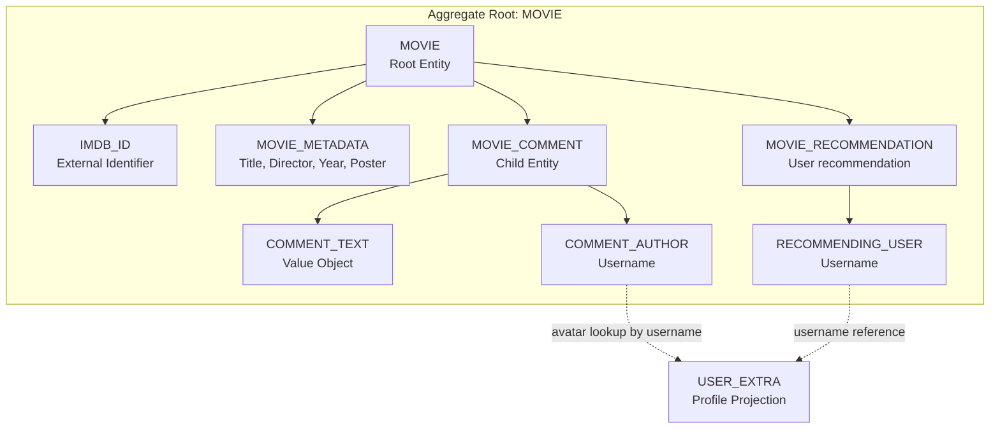
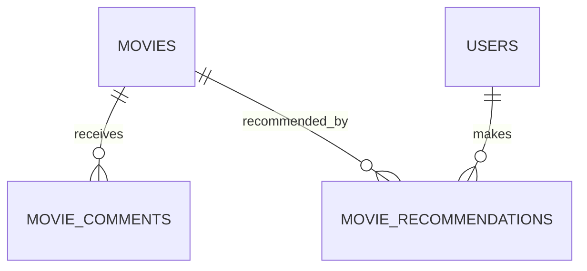

# Movie Catalog Capability Entity Model

The `movie-catalog` Software Capability owns movie discovery, movie contribution, movie discussion, movie
recommendations, and admin movie maintenance. The `MOVIE` aggregate is the consistency boundary. `MOVIE_COMMENT` is a
child entity because comments cannot exist without a movie and are deleted with it. `MOVIE_RECOMMENDATION` records the
current user's endorsement of a movie.

## Aggregate Boundary Diagram

## Entity Relationship Diagram

### MOVIE

| Attribute | Description | Data Type | Validation Rules |
|-----------|-------------|-----------|------------------|
| imdb_id | IMDb identifier used as catalog identity | String | Primary Key, Not Blank |
| title | Movie title shown in catalog cards | String | Not Null, Not Blank on create |
| director | Director name or `N/A` | String | Not Null, Not Blank on create |
| release_year | Release year or `N/A` | String | Not Null, Not Blank on create |
| poster | Poster URL from OMDb or fallback image | String | Optional, max 2048 characters |

### MOVIE_COMMENT

| Attribute | Description | Data Type | Validation Rules |
|-----------|-------------|-----------|------------------|
| id | Comment identifier | Long | Primary Key, Identity |
| movie_imdb_id | Owning movie | String | Foreign Key, Cascade Delete |
| username | Comment author | String | Not Null, taken from authenticated principal |
| text | User comment | String | Not Blank, max 4000 characters |
| timestamp | Creation time | Instant | Not Null |

### MOVIE_RECOMMENDATION

| Attribute | Description | Data Type | Validation Rules |
|-----------|-------------|-----------|------------------|
| user_id | Recommending username | String | Foreign Key to users.username, Primary Key part |
| movie_id | Recommended IMDb id | String | Foreign Key to movies.imdb_id, Primary Key part |

### MOVIE_CATALOG

Read model used by `view-movie-catalog`.

| Attribute | Description | Data Type | Validation Rules |
|-----------|-------------|-----------|------------------|
| movies | Movies sorted by title | List<MOVIE> | May be empty |
| recommended | Whether each movie is recommended by the current user | Boolean | False for anonymous viewers |

### MOVIE_DETAILS

Read model used by `view-movie-details`.

| Attribute | Description | Data Type | Validation Rules |
|-----------|-------------|-----------|------------------|
| movie | Selected movie | MOVIE | Must exist |
| comments | Comments with avatar data | List<MOVIE_COMMENT> | Newest first |
| recommended | Whether the selected movie is recommended by the current user | Boolean | False for anonymous viewers |

## Aggregate Insight

`add-movie-to-catalog`, `add-movie-comment`, `recommend-movie`, and `administer-movie-catalog` mutate the movie-catalog
model. Catalog and detail views are read use cases over the same aggregate and include recommendation state when the
viewer is authenticated. Comment avatar enrichment crosses into `user-access` only as a read lookup by username.
