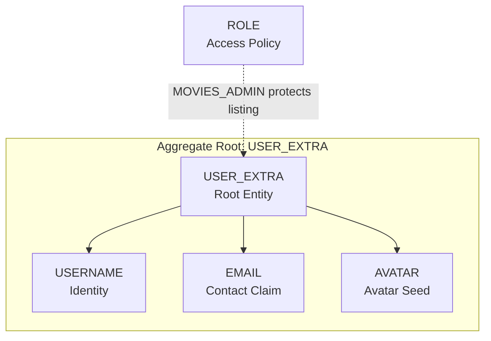
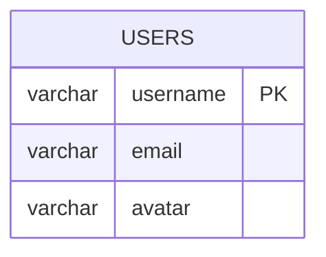

# User Access Capability Entity Model

The `user-access` Software Capability owns application-local user profile data and admin visibility over registered
users. Authentication and token issuance are delegated to Keycloak. The bounded context consumes JWT claims and stores a
small `USER_EXTRA` projection for UI display.

## Aggregate Boundary Diagram

## Entity Relationship Diagram

### USER_EXTRA

| Attribute | Description | Data Type | Validation Rules |
|-----------|-------------|-----------|------------------|
| username | Application username | String | Primary Key, Not Blank |
| email | Email copied from JWT or fallback | String | Not Null |
| avatar | Avatar seed used by the UI | String | Not Null |

### ROLE

Access policy concept derived from JWT role claims. Roles are not persisted in the movie database.

| Role | Meaning |
|------|---------|
| `MOVIES_USER` | Authenticated regular user. Can create movies, comment, and view own profile. |
| `MOVIES_ADMIN` | Admin user. Inherits regular access and can view registered users and administer movies. |

## Access Rules

- `GET /api/userextras/me` is available to any authenticated user and synchronizes the user's profile projection.
- `/api/users` and `/api/users/**` require `MOVIES_ADMIN`.
- The UI hides the Admin menu for non-admin users, but API authorization remains enforced by Spring Security.
