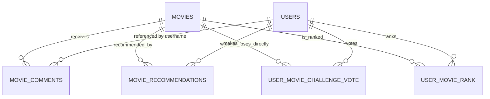

# Entity Model

This file is the full-system reference. The DDD source of truth is split by Software Capability under
[`docs/specs`](specs/), where each capability owns `entity_model.md` and `glossary.md`.

## Bounded Context Overview

```mermaid
flowchart LR
    subgraph movie_catalog["movie-catalog"]
        MOVIE["MOVIE\nAggregate Root"]
        MOVIE_COMMENT["MOVIE_COMMENT\nChild Entity"]
        MOVIE_RECOMMENDATION["MOVIE_RECOMMENDATION\nUser recommendation"]
        USER_MOVIE_CHALLENGE_VOTE["USER_MOVIE_CHALLENGE_VOTE\nDirect challenge vote"]
        USER_MOVIE_RANK["USER_MOVIE_RANK\nRank projection"]
        USER_MOVIE_RATING["USER_MOVIE_RATING\n0-10 rating view"]
    end

    subgraph user_access["user-access"]
        USER_EXTRA["USER_EXTRA\nUser Profile Projection"]
        ROLE["ROLE\nAccess Policy Concept"]
    end

    MOVIE ||--o{ MOVIE_COMMENT : receives
    MOVIE ||--o{ MOVIE_RECOMMENDATION : recommended_by
    MOVIE ||--o{ USER_MOVIE_CHALLENGE_VOTE : wins_or_loses_directly
    MOVIE ||--o{ USER_MOVIE_RANK : is_ranked
    USER_MOVIE_RANK --> USER_MOVIE_RATING : projects
    MOVIE_COMMENT --> USER_EXTRA : "renders avatar for username"
    ROLE --> USER_EXTRA : "protects admin listing"
```

## Entity Relationship Diagram



### MOVIE

Represents a title in the Movie Stream catalog.

| Attribute | Description | Data Type | Validation Rules |
|-----------|-------------|-----------|------------------|
| imdb_id | External movie identifier | String | Primary Key, Not Blank |
| title | Display title | String | Not Null, Not Blank on create |
| director | Director or `N/A` | String | Not Null, Not Blank on create |
| release_year | Release year or `N/A` | String | Not Null, Not Blank on create |
| poster | Poster URL | String | Optional, max 2048 characters |

### MOVIE_COMMENT

Represents a user-authored comment attached to one movie.

| Attribute | Description | Data Type | Validation Rules |
|-----------|-------------|-----------|------------------|
| id | Unique comment identifier | Long | Primary Key, Identity |
| movie_imdb_id | Owning movie reference | String | Foreign Key to `movies.imdb_id`, Cascade Delete |
| username | Author username from JWT principal | String | Not Null |
| text | Comment text | String | Not Blank, max 4000 characters |
| timestamp | Creation instant | Instant | Not Null, ordered newest first |

### USER_EXTRA

Represents the application-local profile projection for an authenticated identity.

| Attribute | Description | Data Type | Validation Rules |
|-----------|-------------|-----------|------------------|
| username | Username from JWT claims | String | Primary Key, Not Blank |
| email | Email from JWT claims or fallback | String | Not Null |
| avatar | Avatar seed used by the UI | String | Not Null |

### MOVIE_RECOMMENDATION

Represents one authenticated user's recommendation of one movie.

| Attribute | Description | Data Type | Validation Rules |
|-----------|-------------|-----------|------------------|
| user_id | Recommending username | String | Foreign Key to `users.username`, Primary Key part |
| movie_id | Recommended movie | String | Foreign Key to `movies.imdb_id`, Primary Key part |

### USER_MOVIE_CHALLENGE_VOTE

Represents one direct Movie Challenge winner-loser decision for one user.

| Attribute | Description | Data Type | Validation Rules |
|-----------|-------------|-----------|------------------|
| user_id | Challenged username | String | Foreign Key to `users.username`, Primary Key part |
| winner_id | Selected winning movie | String | Foreign Key to `movies.imdb_id`, Primary Key part |
| loser_id | Losing movie from the same challenge | String | Foreign Key to `movies.imdb_id`, Primary Key part, different from winner_id |

### USER_MOVIE_RANK

Represents the current per-user ranking projection rebuilt from direct challenge votes.

| Attribute | Description | Data Type | Validation Rules |
|-----------|-------------|-----------|------------------|
| user_id | Ranked username | String | Foreign Key to `users.username`, Primary Key part |
| movie_id | Ranked movie | String | Foreign Key to `movies.imdb_id`, Primary Key part |
| rank_position | Current rank, where `1` is best | Integer | Positive, unique per user |
| score | Internal regularized ranking score on a positive 1-10 scale | Decimal | Not Null, not user-facing |
| direct_comparisons | Number of direct votes containing the movie | Integer | Not Null, non-negative |

### USER_MOVIE_RATING

Represents the per-user rank mapped onto the 0-10 rating scale.

| Attribute | Description | Data Type | Validation Rules |
|-----------|-------------|-----------|------------------|
| user_id | Rated username | String | Derived from `user_movie_rank` |
| movie_id | Rated movie | String | Derived from `user_movie_rank` |
| rank_position | Current rank, where `1` is best | Integer | Derived from `user_movie_rank` |
| rating | Rank mapped onto the 0-10 scale | Decimal | `10` for best, `0` for worst, linearly distributed between |

## Cross-Context Policies

- `MOVIE` owns `MOVIE_COMMENT` as a child entity because comment lifecycle is scoped to the movie.
- `USER_EXTRA` does not own comments. Comments store usernames only and resolve avatar data through the user-access
  read model.
- `MOVIES_ADMIN` is required for `/api/users` and movie administration endpoints.
- Authenticated non-admin users can read only their own profile through `GET /api/userextras/me`.
- Users recommended movies exclude the current user's own recommendations and rank remaining movies by a regularized
  average of other users' calculated ratings. User similarity is confidence-weighted Pearson correlation over shared
  calculated ratings. Non-positive neighbors do not contribute.
- Movie list cards show the viewer-specific `Your Rating` with rank in parentheses, for example `9.6 (#2)`.
  When rating or rank is absent, the UI renders `-`.
