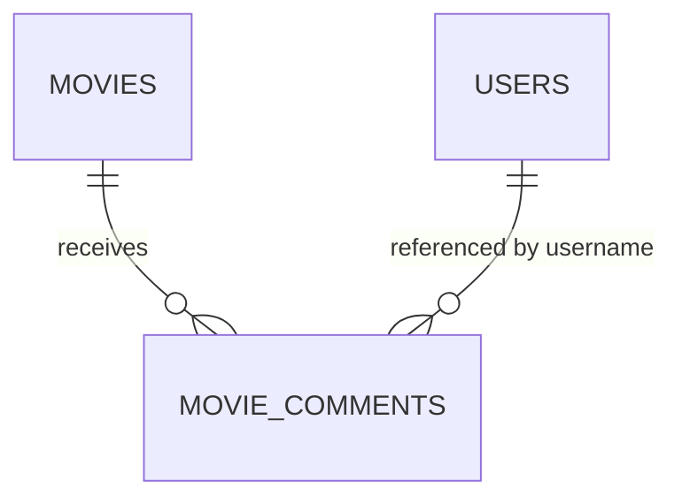

# Entity Model

This file is the full-system reference. The DDD source of truth is split by Software Capability under
[`docs/capabilities`](capabilities/), where each capability owns `entity_model.md` and `glossary.md`.

## Bounded Context Overview

```mermaid
flowchart LR
    subgraph movie_catalog["movie-catalog"]
        MOVIE["MOVIE\nAggregate Root"]
        MOVIE_COMMENT["MOVIE_COMMENT\nChild Entity"]
    end

    subgraph user_access["user-access"]
        USER_EXTRA["USER_EXTRA\nUser Profile Projection"]
        ROLE["ROLE\nAccess Policy Concept"]
    end

    MOVIE ||--o{ MOVIE_COMMENT : receives
    MOVIE_COMMENT --> USER_EXTRA : "renders avatar for username"
    ROLE --> USER_EXTRA : "protects admin listing"
```

## Entity Relationship Diagram



### MOVIE

Represents a title in the Movie Stream catalog.

| Attribute | Description | Data Type | Validation Rules |
|-----------|-------------|-----------|------------------|
| imdb_id | External movie identifier | String | Primary Key, Not Blank |
| title | Display title | String | Not Null, Not Blank on create |
| director | Director or `N/A` | String | Not Null, Not Blank on create |
| release_year | Release year or `N/A` | String | Not Null, Not Blank on create |
| poster | Poster URL | String | Optional, max 2048 characters |

### MOVIE_COMMENT

Represents a user-authored comment attached to one movie.

| Attribute | Description | Data Type | Validation Rules |
|-----------|-------------|-----------|------------------|
| id | Unique comment identifier | Long | Primary Key, Identity |
| movie_imdb_id | Owning movie reference | String | Foreign Key to `movies.imdb_id`, Cascade Delete |
| username | Author username from JWT principal | String | Not Null |
| text | Comment text | String | Not Blank, max 4000 characters |
| timestamp | Creation instant | Instant | Not Null, ordered newest first |

### USER_EXTRA

Represents the application-local profile projection for an authenticated identity.

| Attribute | Description | Data Type | Validation Rules |
|-----------|-------------|-----------|------------------|
| username | Username from JWT claims | String | Primary Key, Not Blank |
| email | Email from JWT claims or fallback | String | Not Null |
| avatar | Avatar seed used by the UI | String | Not Null |

## Cross-Context Policies

- `MOVIE` owns `MOVIE_COMMENT` as a child entity because comment lifecycle is scoped to the movie.
- `USER_EXTRA` does not own comments. Comments store usernames only and resolve avatar data through the user-access
  read model.
- `MOVIES_ADMIN` is required for `/api/users` and movie administration endpoints.
- Authenticated non-admin users can read only their own profile through `GET /api/userextras/me`.
