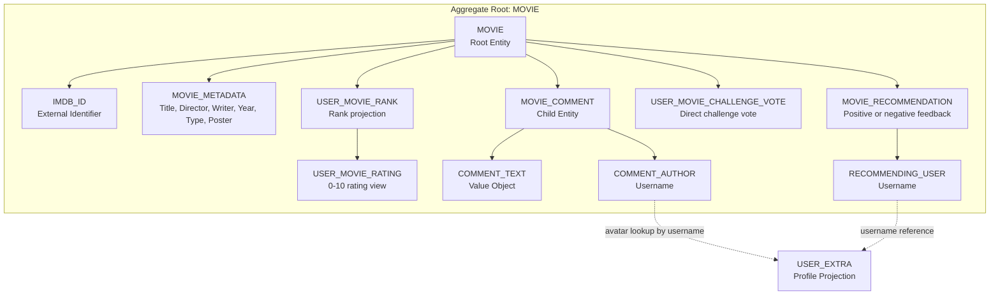
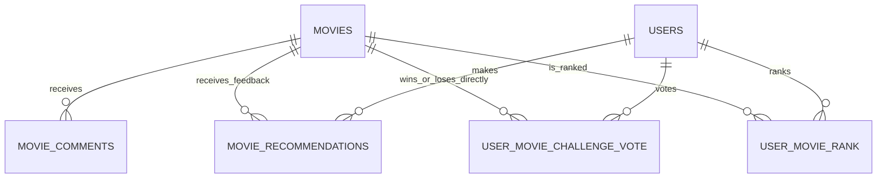

# Movie Catalog Capability Entity Model

The `movie-catalog` Software Capability owns movie discovery, movie contribution, movie discussion, movie
recommendations, movie challenges, and admin movie maintenance. The `MOVIE` aggregate is the consistency boundary.
`MOVIE_COMMENT` is a child entity because comments cannot exist without a movie and are deleted with it.
`MOVIE_RECOMMENDATION` records the current user's positive or negative feedback for a movie. Movie challenge records are
per-user projections over positively recommended movies: `USER_MOVIE_CHALLENGE_VOTE` stores only direct choices,
`USER_MOVIE_RANK` rebuilds the current rank, positive ranking score, comparison count, and confidence from those choices, and
`USER_MOVIE_RATING` maps rank positions to 0-10 ratings. The selector avoids direct duplicate pairs and skips only
far-apart pairs with enough direct evidence and confidence, so weak inferred rankings can still be challenged.

## Aggregate Boundary Diagram

## Entity Relationship Diagram

### MOVIE

| Attribute | Description | Data Type | Validation Rules |
|-----------|-------------|-----------|------------------|
| imdb_id | IMDb identifier used as catalog identity | String | Primary Key, Not Blank |
| title | Movie title shown in catalog cards | String | Not Null, Not Blank on create |
| director | Director name or `N/A` | String | Not Null, Not Blank on create |
| writer | Writer name or `N/A` | String | Optional for existing rows, Not Blank on create |
| release_year | Release year or `N/A` | String | Not Null, Not Blank on create |
| poster | Poster URL from OMDb or fallback image | String | Optional, max 2048 characters |
| genre | Genre list from OMDb | String | Optional |
| country | Country list from OMDb | String | Optional |
| type | OMDb title type, stored as explicit enum code `0` Movie or `1` Series | Integer / MovieType | Not Null, defaults to Movie, constrained to allowed enum codes |

### MOVIE_COMMENT

| Attribute | Description | Data Type | Validation Rules |
|-----------|-------------|-----------|------------------|
| id | Comment identifier | Long | Primary Key, Identity |
| movie_imdb_id | Owning movie | String | Foreign Key, Cascade Delete |
| username | Comment author | String | Not Null, taken from authenticated principal |
| text | User comment | String | Not Blank, max 4000 characters |
| timestamp | Creation time | Instant | Not Null |

### MOVIE_RECOMMENDATION

| Attribute | Description | Data Type | Validation Rules |
|-----------|-------------|-----------|------------------|
| user_id | Feedback author username | String | Foreign Key to users.username, Primary Key part |
| movie_id | Feedback IMDb id | String | Foreign Key to movies.imdb_id, Primary Key part |
| positive | Whether the feedback is a positive recommendation | Boolean | Not Null, default `true`; `false` means disliked |

### USER_MOVIE_CHALLENGE_VOTE

| Attribute | Description | Data Type | Validation Rules |
|-----------|-------------|-----------|------------------|
| user_id | Challenged username | String | Foreign Key to users.username, Primary Key part |
| winner_id | Directly selected winning movie | String | Foreign Key to movies.imdb_id, Primary Key part |
| loser_id | Directly defeated movie in the same challenge | String | Foreign Key to movies.imdb_id, Primary Key part, different from winner_id |

### USER_MOVIE_RANK

| Attribute | Description | Data Type | Validation Rules |
|-----------|-------------|-----------|------------------|
| user_id | Ranked username | String | Foreign Key to users.username, Primary Key part |
| movie_id | Ranked movie | String | Foreign Key to movies.imdb_id, Primary Key part |
| rank_position | Current rank, where `1` is best | Integer | Positive, unique per user |
| score | Internal regularized ranking score on a positive 1-10 scale | Decimal | Not Null, not user-facing |
| direct_comparisons | Number of direct votes containing the movie | Integer | Not Null, non-negative |
| confidence | Confidence derived from direct comparisons | Decimal | Not Null, between `0` and `1` |

### USER_MOVIE_RATING

| Attribute | Description | Data Type | Validation Rules |
|-----------|-------------|-----------|------------------|
| user_id | Rated username | String | Derived from USER_MOVIE_RANK |
| movie_id | Rated movie | String | Derived from USER_MOVIE_RANK |
| rank_position | Current rank, where `1` is best | Integer | Derived from USER_MOVIE_RANK |
| score | Internal regularized ranking score | Decimal | Derived from USER_MOVIE_RANK, not user-facing |
| direct_comparisons | Number of direct votes containing the movie | Integer | Derived from USER_MOVIE_RANK |
| confidence | Challenge confidence | Decimal | Derived from USER_MOVIE_RANK |
| rating | Rank mapped onto the 0-10 scale | Decimal | `10` for best, `0` for worst, evenly distributed between |

### MOVIE_CATALOG

Read model used by `view-movie-catalog`.

| Attribute | Description | Data Type | Validation Rules |
|-----------|-------------|-----------|------------------|
| movies | Movies sorted by title | List<MOVIE> | May be empty |
| recommended | Whether each movie is positively recommended by the current user | Boolean | False for anonymous viewers |
| disliked | Whether each movie is disliked by the current user | Boolean | False for anonymous viewers |
| your_rank | Current authenticated user's rank for the movie | Integer / null | Null when the movie has no rank for the viewer; list UI shows it as `(#rank)` after rating |
| your_rating | Current authenticated user's 0-10 rating for the movie, shown as `Your Rating` | Decimal / null | Null when the movie has no rating for the viewer; list UI renders `-` |

### MOVIE_DETAILS

Read model used by `view-movie-details`.

| Attribute | Description | Data Type | Validation Rules |
|-----------|-------------|-----------|------------------|
| movie | Selected movie | MOVIE | Must exist |
| comments | Comments with avatar data | List<MOVIE_COMMENT> | Newest first |
| recommended | Whether the selected movie is positively recommended by the current user | Boolean | False for anonymous viewers |
| disliked | Whether the selected movie is disliked by the current user | Boolean | False for anonymous viewers |
| your_rank | Current authenticated user's rank for the movie, shown separately on details | Integer / null | Null when the movie has no rank for the viewer; UI renders `-` |
| your_rating | Current authenticated user's 0-10 rating for the movie, shown as `Your Rating` | Decimal / null | Null when the movie has no rating for the viewer; UI renders `-` |

### MOVIE_CHALLENGE

Read model used by `movie-challenge`.

| Attribute | Description | Data Type | Validation Rules |
|-----------|-------------|-----------|------------------|
| movie1 | First recommended movie in the challenge pair | MOVIE metadata | Selected from recommended movies only |
| movie2 | Second recommended movie in the challenge pair | MOVIE metadata | Different from movie1 |
| direct_vote | Actual selected winner-loser relationship | USER_MOVIE_CHALLENGE_VOTE | Written when the user chooses a winner |
| rank | Current rank projection | USER_MOVIE_RANK | Used to skip confident far-apart pairs and stop low-value far pairs once both movies reach the dynamic comparison target |

### FAVORITE_MOVIES

Read model used by `view-favorite-movies`.

| Attribute | Description | Data Type | Validation Rules |
|-----------|-------------|-----------|------------------|
| movies | Positive recommendations for the current user | List<MOVIE> | Sorted by `USER_MOVIE_RATING.rank_position` when ranked, then title |
| recommended | Whether each favorite movie is still positively recommended by the current user | Boolean | Enriched from MOVIE_RECOMMENDATION |
| your_rank | Current user's rank for each listed movie | Integer / null | List UI shows it as `(#rank)` after rating |
| your_rating | Current user's 0-10 rating for each listed movie, shown as `Your Rating` | Decimal / null | List UI renders `-` when absent |

### USERS_FAVORITE_MOVIES

Read model used by `view-users-favorite-movies`.

| Attribute | Description | Data Type | Validation Rules |
|-----------|-------------|-----------|------------------|
| movies | Movies with community challenge ratings | List<MOVIE> | Sorted by average rating descending and voter count descending |
| recommended | Whether each community favorite movie is positively recommended by the current user | Boolean | Enriched from MOVIE_RECOMMENDATION |
| your_rank | Current viewer's own rank for each listed movie | Integer / null | List UI shows it as `(#rank)` after rating |
| your_rating | Current viewer's own 0-10 rating for each listed movie, shown as `Your Rating` | Decimal / null | List UI renders `-` when absent |

### USERS_RECOMMENDED_MOVIES

Read model used by `view-users-recommended-movies`.

| Attribute | Description | Data Type | Validation Rules |
|-----------|-------------|-----------|------------------|
| movies | Movies with a positive weighted rating from similar users | List<MOVIE> | Excludes movies recommended or disliked by the current user |
| rating_similarity | Similarity from shared calculated movie ratings | Decimal | `70%` of the user-similarity signal, capped by shared-rating confidence |
| direct_vote_agreement | Similarity from same winner choices on shared direct challenge pairs | Decimal | `30%` of the user-similarity signal, capped by shared-pair confidence |
| weighted_movie_rating | Weighted score used for descending sort | Decimal | `sum(candidate_rating * similarity) / sum(similarity)` |
| recommended | Whether each listed movie is positively recommended by the current user | Boolean | False until the user clicks Like |
| disliked | Whether each listed movie is disliked by the current user | Boolean | False until the user clicks Dislike; disliked movies are excluded on refresh |
| your_rank | Current viewer's own rank for each listed movie | Integer / null | List UI shows it as `(#rank)` after rating |
| your_rating | Current viewer's own 0-10 rating for each listed movie, shown as `Your Rating` | Decimal / null | List UI renders `-` when absent |

## Aggregate Insight

`add-movie-to-catalog`, `add-movie-comment`, `recommend-movie`, `movie-challenge`, and `administer-movie-catalog` mutate
the movie-catalog model. Catalog, detail, favorite, and users recommended views are read use cases over the same
aggregate and include recommendation state when the viewer is authenticated. Comment avatar enrichment crosses into
`user-access` only as a read lookup by username. Catalog, detail, favorite, community favorite, and users recommended
list views expose the viewer-specific `Your Rating` with rank in parentheses when both values exist; otherwise the UI
displays `-`.
