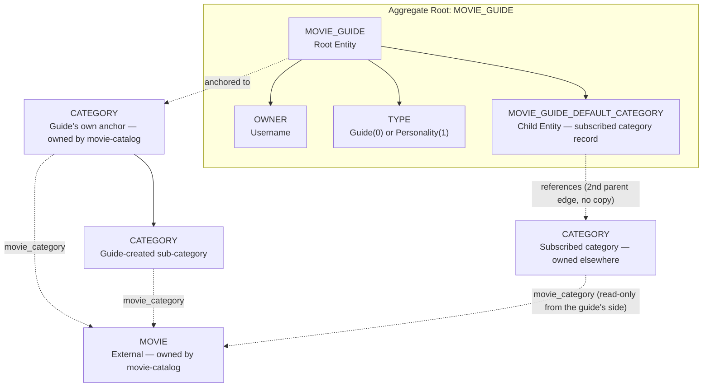
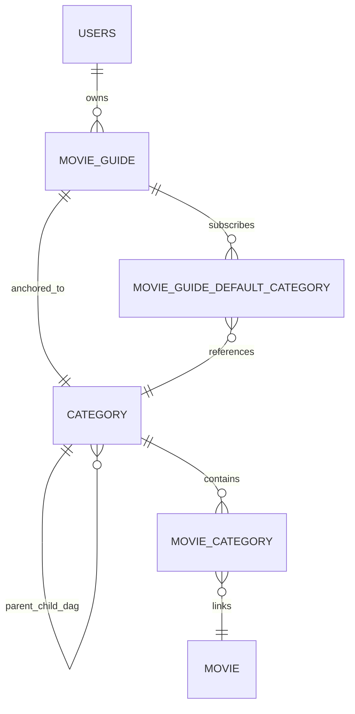

# Movie Guides Capability Entity Model

The `movie-guides` Software Capability owns curated, human-owned collections of movies: **Movie Guides** (organized
around a topic, e.g. "Essential Heist Films") and **Movie Personalities** (organized around a real or fictitious
taste, e.g. "What Kubrick Would Watch"). Both share one mechanism and differ only in which root category their
anchor lives under. The `MOVIE_GUIDE` aggregate is the consistency boundary; `MOVIE_GUIDE_DEFAULT_CATEGORY` is a
child entity recording which categories a guide has subscribed to.

A Movie Guide does not own its movies or categories directly. Instead, every guide is anchored to one `CATEGORY` row
(owned by the shared `movie-catalog` category tree, see below), and "curating" a guide means linking movies and
categories into that anchor's subtree via the same `category_parent_child` DAG the rest of the catalog uses. This
keeps a guide's content queryable through the ordinary category/movie machinery, and lets a guide **subscribe** to
an existing category elsewhere in the tree (e.g. "New 2026") by adding a second, non-exclusive parent edge onto it,
rather than copying or duplicating it. Movies added to a subscribed category later are automatically visible through
the guide too, with zero duplication.

Subscribing is intentionally asymmetric with owning: many different guides may subscribe to the very same category
at the same time (each subscription is just one more incoming edge on that category), while only a genuine *move*
of a category (changing its one native parent) is blocked once any guide already depends on it.

## Aggregate Boundary Diagram

## Entity Relationship Diagram

### MOVIE_GUIDE

| Attribute | Description | Data Type | Validation Rules |
|-----------|-------------|-----------|------------------|
| id | Guide identifier | Long | Primary Key, Identity |
| category_id | The guide's own anchor category | Long | Foreign Key to category.id, unique — one guide per category |
| type | Guide or Personality, stored as explicit enum code `0` Guide or `1` Personality | Integer / MovieGuideType | Not Null, constrained to allowed enum codes; never reorder or remove existing codes, only append |
| name | Guide/Personality display name | String | Not Blank, max 200 characters; unique (case-insensitive) among siblings under the same root (`Guides` or `Personalities`) |
| description | Optional summary | String | Optional, max 2000 characters |
| icon | Display emoji | String | Optional, max 32 characters; defaults to 🗺️ for Guide / 🌟 for Personality |
| owner | Username of the creator | String | Not Null, taken from the authenticated principal at creation; only the owner (or MOVIES_GUIDE/MOVIES_ADMIN) may manage |

### MOVIE_GUIDE_DEFAULT_CATEGORY

Records every category a guide has subscribed to. `category_id` and `referenced_category_id` are always equal — the
non-null `referenced_category_id` is the marker that this `category_id`, wherever it appears in the tree, is a live
reference rather than something the guide created itself.

| Attribute | Description | Data Type | Validation Rules |
|-----------|-------------|-----------|------------------|
| movie_guide_id | Owning guide | Long | Foreign Key to movie_guide.id, Cascade Delete, Primary Key part |
| category_id | The subscribed category | Long | Foreign Key to category.id, Primary Key part |
| referenced_category_id | Self-reference marker (always equals category_id) | Long | Not Null when the row exists; absence of a row for a category_id means "not subscribed" |

### MOVIE_GUIDE_DTO

Read/write model exposed by the API (`GET by-category`, `POST wizard`, `POST subscribe`).

| Attribute | Description | Data Type | Validation Rules |
|-----------|-------------|-----------|------------------|
| id | Guide identifier | Long | — |
| category_id | Anchor category id | Long | — |
| type | `"Guide"` or `"Personality"` | String | Derived from the persisted ordinal |
| name, description, icon, owner | Same as MOVIE_GUIDE | — | — |
| subscribed_category_ids | Category ids from MOVIE_GUIDE_DEFAULT_CATEGORY for this guide | List<Long> | May be empty |

## Aggregate Insight

`curate-movie-guide` is the sole use case over this aggregate: it covers creation, subscribing to categories, adding
movies (directly or via CSV import), listing a user's own guides, and deletion. It reaches into the shared
`movie-catalog` category tree (`CATEGORY`, `category_parent_child`, `category_parent_child_all`) as an external
collaborator rather than owning it — category creation, the DAG closure rebuild, and cycle protection are all
`CategoryService` responsibilities reused unchanged. A plain owner may add movies to the guide's own anchor or a
category the guide created natively, but never directly to a subscribed category (`MOVIE_GUIDE_DEFAULT_CATEGORY`
match) — that stays read-only from the guide's side, managed only at its original location, unless the actor is
MOVIES_GUIDE or MOVIES_ADMIN. Deleting a guide's anchor category cascades to everything the guide created natively,
but a category the guide only subscribed to is unlinked, never destroyed, regardless of how many other guides also
subscribe to it.
